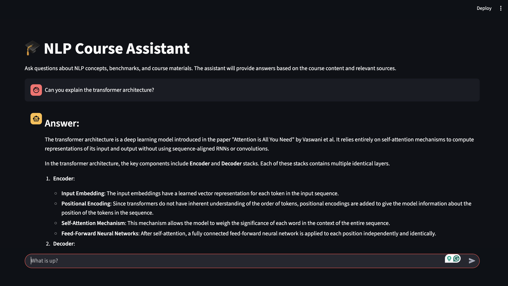

Retrieval-Augmented Generation, or RAG, has led to leaps and bounds in improvements in the Natural Language Processing scene. This project explores the use of RAG systems in an academic setting. We plan to leverage course materials and research papers commonly discussed in graduate level NLP courses at a variety of educational institutions, to aid students’ understanding of NLP. At its core, the project is an exploration in the tasks of question answering and synthetic question generation.

## Motivation

The average human reads at around 250 words per minute. For a 7000 word research paper, that amounts to around 28 minutes to just go through the paper. From our personal experiences, we have found that it takes much longer to read through such papers and even longer to understand the content fully.

In graduate level NLP courses, there are likely to be a large number of such research works, lecture slides, web pages, code, documentation etc. to go through for the duration of the course. One may quickly become overwhelmed with the thought of covering all of this content and fail to perform to their full potential.

We have built a RAG system that can equip an LLM (GPT-4o for example) with knowledge from course materials (web pages, documentation, PDFs, Python notebooks, Python code etc.) and research papers to answer questions previously encountered in assessments (mid-terms, sample questions etc.). It is also able to generate sample questions based on the content provided. We expect that the former task will allow students in NLP courses to strengthen their understanding with solutions and logical approaches to questions and the content they referred to, and the latter will assist them with preparing for their own assessments by adding to the pool of sample questions that they can attempt to test the breadth of their knowledge.

We are inspired by the use of LLMs in academic assessments (GPTs used to take AP, SAT exams, GPTs excelling at MOOCs) and the fact that their performance almost regularly exceeds human performance on the same tasks. We extend that work to incorporate contextual knowledge (the principle of RAG) to these LLMs' prompts and generate specific academic help.

## Approach

The approach is divided into two segments - creating the RAG pipeline, and evaluating the system's performance

### Creating the RAG pipeline

This is composed of the following subsegments

#### Parsing and chunking materials

The input materials are parsed and divided into smaller, coherent chunks to ensure meaningful embeddings. Metadata such as the chunk text, its position in the source document, and the document type are retained for traceability.

#### Embedding chunks and storing on vector database

We use the OpenAI `text-embedding-ada-002` model to generate embeddings for each chunk. These embeddings are stored in a Pinecone vector database, along with associated metadata.

Let:

- $ C = \{c_1, c_2, \ldots, c_n\} $ be the set of chunks.
- $ E*C = \{e*{c*1}, e*{c*2}, \ldots, e*{c*n}\} $ be the corresponding embeddings generated by the model, where \( e*{c_i} \in \mathbb{R}^d \).

The Pinecone database stores pairs $ \{(e*{c_i}, \text{metadata}\_i)\}*{i=1}^n $.

#### Query embedding and retrieval

At runtime, user queries $ q $ are embedded into the same vector space as the chunks using the embedding model:  
$ e_q = \text{Embedding}(q) \quad \text{where} e_q \in \mathbb{R}^d. $

To identify relevant chunks:

1. Compute cosine similarity between the query embedding $ e*q $ and all chunk embeddings $ e*{c*i} $:  
   $
   \text{CosineSim}(e_q, e*{c*i}) = \frac{e_q \cdot e*{c*i}}{\|e_q\| \|e*{c_i}\|}
   $
2. Retrieve the top-k most similar chunks $ \{c*{t_1}, c*{t*2}, \ldots, c*{t_k}\} $ based on the similarity scores.

#### Augmenting a prompt and generating a response

The retrieved chunks are combined with the query and fed into `gpt-4o-mini` using a carefully designed prompt to generate a response.

### Evaluating performance

Ideally we would obtain human-annotated data, but our application is too novel and there are no specific datasets for our use. We therefore resort to LLMs to judge our outputs and generate ground truths based on some reference material. We evaluate the following:

#### Accuracy of retrieval

Using `Precision@k` and `Recall@k`, we measure how accurately our system can refer to and retrieve relevant documents from the database

`Precision@k`  
Measures the proportion of relevant chunks in the top-\(k\) retrieved chunks:  
$
\text{Precision@k} = \frac{\text{Number of relevant chunks in top-}k}{k}
$

`Recall@k`
Measures the proportion of all relevant chunks that appear in the top-\(k\):  
$
\text{Recall@k} = \frac{\text{Number of relevant chunks in top-}k}{\text{Total number of relevant chunks}}
$

#### Accuracy of generation

Responses generated by the system are evaluated using a secondary LLM (`gpt-4o-mini`), which serves as a judge basing its responses on provided samples

## Data

For our experiments, we used the CMPT-713 lecture PDFs, reference web pages, research papers, sample QAs and code as our source of LLM knowledge; these were the documents we embedded and stored on Pinecone for our RAG. The data is found in the data/input/full folder.

As mentioned previously, we also resorted to the use of ChatGPT generating QA data based on some of the materials listed above. For this we used crafted prompts like "You are a grad-level NLP TA. Based on this document, generate X questions for a mid-term" for example

## Conclusions

We demonstrate that even without advanced techniques like LoRA fine-tuning, instruct tuning and immense prompt engineering, we are able to use our RAG system to generate reasonably decent questions synthetically, and also perform fairly well on answering NLP-specific questions citing the references. We believe that these two are crucial aids in a graduate NLP student's journey to excelling in their pursuits.

However, our work is not without its limitations. We acknowledge that there can be experiments with higher dimensional embedding models, more specifcally fine tuned GPT models, better chunking strategies than fixed-size chunking etc. It would also be very helpful to have other humans and students both evaluate our system and contribute to creating datasets like the ones we relied on ChatGPT to create, so that this niche field can be further explored.
