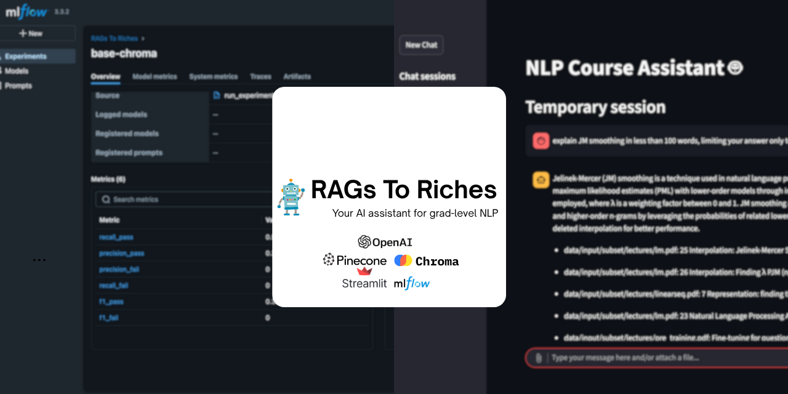

Retrieval-Augmented Generation, or RAG, has led to leaps and bounds in improvements in the Natural Language Processing scene. This project explores the use of RAG systems in an academic setting. Leveraging course materials and research papers commonly discussed in graduate level NLP courses at a variety of educational institutions, the RAG system aids students’ understanding of NLP. At its core, the project is an exploration in the tasks of question answering and synthetic question generation.

### TL;DR

- RAG pipeline fed with and ingesting NLP materials to help prep for grad-level NLP courses
- Modular pipeline to easily swap out components like parsers, chunkers, embedders, vector stores, retrievers, generators, prompts etc.
- MLflow experimentation pipeline to run trials on different prompts and LLM calls
- Streamlit chat UI with session persistence

## Motivation

The average human reads at around 250 words per minute. For a 7000 word research paper, that amounts to around 28 minutes to just go through the paper, and even longer to understand the content fully. In graduate level NLP courses, there are likely to be a large number of such research works, lecture slides, web pages, code, documentation etc. to go through for the duration of the course. One may quickly become overwhelmed with the thought of covering all of this content and fail to perform to their full potential.

This RAG system can equip an LLM (GPT-4o for example) with knowledge from course materials (web pages, documentation, PDFs, Python notebooks, Python code etc.) and research papers to answer questions previously encountered in assessments (mid-terms, sample questions etc.). It is also able to generate sample questions based on the content provided. The former task will allow students in NLP courses to strengthen their understanding with solutions and logical approaches to questions and the content they referred to, and the latter will assist them with preparing for their own assessments by adding to the pool of sample questions that they can attempt to test the breadth of their knowledge.

## Approach

The approach is divided into three segments

- Creating the RAG pipeline
- Evaluating the system's performance in a series of MLflow experiments
- Creating a Streamlit UI to mimic a chat-like interface to interact with the system

### Creating the RAG pipeline

The pipeline consists of a set of parsers, a chunker, an embedder, a vector database/store, a retriever and an LLM call (a generator). The pipeline is built in a way that any of these components can be easily swapped in for other variants, by instantiating class objects accordingly. For example the Pinecone vector database can be swapped for a Chroma vector database by using ChromaVectorStore instead of PineconeVectorStore, both of which are abstracted in BaseVectorStore. It is also possible to configure individual components using YAML files which are loaded at runtime.

The pipeline's components achieve the following:

#### Parsing and chunking materials

The input materials are parsed and divided into smaller, coherent chunks to ensure meaningful embeddings. Metadata such as the chunk text, its position in the source document, and the document type are retained for traceability.

There are parsers in place for PDFs, Python notebooks, HTML files and specifically formatted CSVs.

#### Embedding chunks and storing on vector database

An embedder then takes the chunks of texts and generates embeddings (vectorizes) for each chunk to store in a vector database of choice.

Primarily, OpenAI's `text-embedding-ada-002` model is used to generate embeddings for each chunk. These embeddings may be stored in Pinecone or Chroma, along with associated metadata.

Let:

- $ C = \{c_1, c_2, \ldots, c_n\} $ be the set of chunks.
- $ E*C = \{e*{c*1}, e*{c*2}, \ldots, e*{c*n}\} $ be the corresponding embeddings generated by the model, where \( e*{c_i} \in \mathbb{R}^d \).

The Pinecone database stores pairs $ \{(e*{c_i}, \text{metadata}\_i)\}*{i=1}^n $.

#### Query embedding and retrieval

At runtime, user queries $ q $ are embedded into the same vector space as the chunks using the embedding model:  
$ e_q = \text{Embedding}(q) \quad \text{where} e_q \in \mathbb{R}^d. $

To identify relevant chunks:

1. Compute cosine similarity between the query embedding $ e*q $ and all chunk embeddings $ e*{c*i} $:  
   $
   \text{CosineSim}(e_q, e*{c*i}) = \frac{e_q \cdot e*{c*i}}{\|e_q\| \|e*{c_i}\|}
   $
2. Retrieve the top-k most similar chunks $ \{c*{t_1}, c*{t*2}, \ldots, c*{t_k}\} $ based on the similarity scores.

Although, now the project relies entirely on Top-K retrieval, there are other retrieval mechanisms that can be explored like agentic retrieval.

#### Augmenting a prompt and generating a response

The retrieved chunks are combined with the query and fed to an LLM, in this case `gpt-4o-mini`, using a carefully designed prompt to generate a response.

### Evaluating performance

Performance is evaluated using a series of MLflow experiments that can be easily configured using YAML files. MLflow serves as an efficient tracking system for each experimental run.

The experiment can be run from the root directory with:

```
python3 -m experiments.run_experiment <experiment-config-dir>
```

where experiment-config-dir is a folder in experiments/configs housing all the config files for the experiment (parsers.yaml, chunker.yaml, embedder.yaml, vector_store.yaml, retriever.yaml, generator.yaml, evaluator.yaml, experiment.yaml). These YAML files control the experiment:

- parsers.yaml: Controls the kind of concrete parser to instantiate for each kind of supported file and the configuration to be passed to each
- chunker.yaml: The type of chunker to be used and the configuration to be passed to it
- embedder.yaml: The type of embedder to be used and the configuration to be passed to it
- vector_store.yaml: The type of vector database/store to be used and the configuration to be passed to it
- retriever.yaml: The type of retriever to be used and the configuration to be passed to it
- generator.yaml: The generator LLM to be used and the configuration (including the path to the system prompt and the question-answering prompt template)
- evaluator.yaml: The type of evaluator to use (primarily the LLM to use as a judge) and the configuration (including the path to the system prompt and the question-answering prompt template) to be passed to it
- experiment.yaml: The data, check queries and their relevant docs to be used in the experiment

The MLflow runs, although basic, list down some metrics, parameters and artifacts stored as a result of the experimental run. The UI can be accessed using:

```
mlflow ui
```

Primarily, the pipeline is evaluated on:

#### Accuracy of retrieval

Using `Precision@k` and `Recall@k`, we measure how accurately our system can refer to and retrieve relevant documents from the database

`Precision@k`  
Measures the proportion of relevant chunks in the top-\(k\) retrieved chunks:  
$
\text{Precision@k} = \frac{\text{Number of relevant chunks in top-}k}{k}
$

`Recall@k`
Measures the proportion of all relevant chunks that appear in the top-\(k\):  
$
\text{Recall@k} = \frac{\text{Number of relevant chunks in top-}k}{\text{Total number of relevant chunks}}
$

#### Accuracy of generation

Responses generated by the system are evaluated using a secondary LLM (`gpt-4o-mini`), which serves as a judge basing its responses on provided samples. The judgement is on the following criteria:

- Factual correctness: Whether the generated answer is factually correct based on the context provided
- Completeness: Whether the generated answer is complete in addressing the query
- Reliance: Is the generated answer reliant solely on the retrieved context
- Overall_accruacy: An overall accuracy score out of 100

### Creating the Streamlit UI

Interactions with the pipeline are done via the Streamlit UI.

The components of the pipeline are configured similary with YAML files (except there is no experiment adn evaluation here, so there are no experiment.yaml and evaluator.yaml files).

The UI is composed of elements that can be modified better in their individual classes. This leads to separation of concerns and allows more separation of concerns.

The UI does need a database to store session and message info, and to that end, an SQLite database is used, although it is entirely possible to switch to other databases.

To run the UI

```
python3 streamlit run app.py
```

## Data

The primary data were the CMPT-713 lecture PDFs, reference web pages, research papers, sample QAs and code as our source of LLM knowledge; these were the documents ingested into our RAG pipeline. The data is found in the data/input/full folder. Subsets of the data are also found in the data/input/subset and data/input/ones folders.
